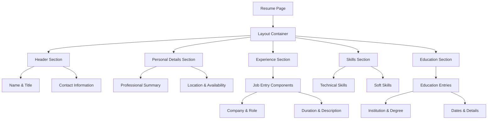

# Design Document: Resume Page Redesign

## Overview

This design transforms the resume page from a complex card-based layout to a clean, minimal design that matches the homepage aesthetic. The redesign focuses on simplifying the visual structure while maintaining professional presentation and all existing functionality.

The approach centers on applying the homepage's design patterns: centered container layout, consistent typography, clean white background, and simple paragraph-based content organization. This creates visual cohesion across the website while preserving the resume's professional credibility.

## Architecture

The resume page redesign follows a component-based architecture that mirrors the homepage structure:



### Design Principles

1. **Consistency First**: Every styling decision aligns with homepage patterns
2. **Content Hierarchy**: Clear visual hierarchy without complex styling
3. **Responsive by Default**: Mobile-first approach matching homepage behavior
4. **Performance Focused**: Minimal CSS complexity for fast loading
5. **Accessibility Maintained**: Semantic structure and proper contrast

## Components and Interfaces

### Layout Container Component
```typescript
interface LayoutContainer {
  className: "max-w-3xl mx-auto p-6"
  children: ReactNode
}
```

The main container applies the same constraints as the homepage: centered layout with maximum width of 3xl and consistent padding.

### Section Component
```typescript
interface ResumeSection {
  title?: string
  children: ReactNode
  spacing: "mb-6" | "mb-3"
}
```

Each resume section follows homepage spacing patterns with consistent margins and clean separation.

### Content Block Component
```typescript
interface ContentBlock {
  heading?: string
  subheading?: string
  content: string | ReactNode
  dateRange?: string
  className?: string
}
```

Individual content blocks (jobs, education, skills) use simple text-based layout without cards or complex styling.

### Typography System
```typescript
interface TypographyClasses {
  mainHeading: "text-2xl font-bold mb-6"
  sectionHeading: "text-xl font-semibold mb-3"
  jobTitle: "text-lg font-medium mb-1"
  company: "text-md text-gray-700 mb-2"
  content: "text-md mb-3"
  dateRange: "text-sm text-gray-600"
}
```

Typography follows homepage patterns with consistent sizing and spacing.

## Data Models

### Resume Data Structure
```typescript
interface ResumeData {
  personalInfo: PersonalInfo
  professionalSummary: string
  experience: WorkExperience[]
  skills: SkillCategory[]
  education: Education[]
}

interface PersonalInfo {
  name: string
  title: string
  email: string
  phone?: string
  location: string
  website?: string
  linkedin?: string
}

interface WorkExperience {
  id: string
  company: string
  position: string
  startDate: string
  endDate?: string
  description: string[]
  technologies?: string[]
}

interface SkillCategory {
  category: string
  skills: string[]
}

interface Education {
  id: string
  institution: string
  degree: string
  field?: string
  startDate: string
  endDate?: string
  details?: string[]
}
```

### Style Configuration
```typescript
interface StyleConfig {
  container: {
    maxWidth: "max-w-3xl"
    margin: "mx-auto"
    padding: "p-6"
  }
  spacing: {
    sectionGap: "mb-6"
    itemGap: "mb-3"
    smallGap: "mb-1"
  }
  typography: {
    contentSize: "text-md"
    headingHierarchy: ["text-2xl", "text-xl", "text-lg"]
  }
}
```

## Correctness Properties

*A property is a characteristic or behavior that should hold true across all valid executions of a system—essentially, a formal statement about what the system should do. Properties serve as the bridge between human-readable specifications and machine-verifiable correctness guarantees.*

### Property 1: Homepage Style Consistency
*For any* resume data input, the rendered resume page should use the same CSS classes and layout patterns as the homepage: max-w-3xl container, p-6 padding, text-md content sizing, and mb-3/mb-6 spacing patterns.
**Validates: Requirements 1.1, 1.2, 2.1, 2.2, 4.3**

### Property 2: Complete Data Preservation  
*For any* resume data input containing personal details, work experience, and skills, all input data should appear in the rendered output without loss or omission.
**Validates: Requirements 3.1, 3.3, 3.5**

### Property 3: Clean Styling Enforcement
*For any* rendered resume page, the output should not contain dark background classes (slate-600, slate-700), border classes, rounded corner classes, or other complex styling elements that differ from homepage aesthetic.
**Validates: Requirements 1.3, 1.4, 7.4**

### Property 4: Work Experience Chronological Ordering
*For any* set of work experience entries with dates, the rendered output should display them in reverse chronological order (most recent first).
**Validates: Requirements 3.2**

### Property 5: Content Organization Structure
*For any* resume data, the rendered page should organize content into logical sections (personal info, experience, skills, education) in a consistent order.
**Validates: Requirements 3.4**

### Property 6: Visual Hierarchy Consistency
*For any* resume content, the rendered HTML should use proper heading hierarchy (h1, h2, h3) and maintain consistent spacing between sections using mb-6 classes.
**Validates: Requirements 5.2, 5.3**

### Property 7: Semantic HTML Structure
*For any* resume data, the rendered HTML should use proper semantic elements (header, section, article) and maintain correct heading hierarchy for accessibility.
**Validates: Requirements 6.1, 6.3, 6.5**

### Property 8: Color Contrast Compliance
*For any* text content on the resume page, the color contrast ratio between text and background should meet WCAG accessibility standards (minimum 4.5:1 for normal text).
**Validates: Requirements 6.2**

### Property 9: CSS Complexity Minimization
*For any* rendered resume page, the total number of unique CSS classes used should not exceed a reasonable threshold, maintaining simplicity consistent with homepage approach.
**Validates: Requirements 7.2**

## Error Handling

The resume page redesign handles various error conditions gracefully:

### Missing Data Scenarios
- **Empty sections**: When resume sections have no data, display appropriate placeholder text or hide the section entirely
- **Incomplete entries**: Handle missing dates, descriptions, or other optional fields without breaking layout
- **Invalid dates**: Validate and format date ranges, handling edge cases like ongoing positions

### Responsive Layout Issues
- **Content overflow**: Ensure long company names or descriptions wrap properly on mobile devices
- **Missing responsive classes**: Fallback to basic responsive behavior if specific classes are missing
- **Viewport edge cases**: Handle very narrow or very wide screens gracefully

### Accessibility Fallbacks
- **Missing alt text**: Provide default alt text for any images or icons
- **Heading hierarchy gaps**: Ensure logical heading progression even with missing sections
- **Color contrast failures**: Provide high-contrast alternatives for any problematic color combinations

## Testing Strategy

The resume page redesign employs a dual testing approach combining unit tests for specific scenarios with property-based tests for comprehensive coverage.

### Unit Testing Focus
Unit tests validate specific examples and edge cases:
- **Empty resume data**: Test behavior with minimal or missing resume information
- **Long content**: Test layout with very long job descriptions or company names
- **Special characters**: Test handling of unicode characters, symbols, and formatting
- **Date edge cases**: Test various date formats and edge cases (current positions, gaps in employment)
- **Mobile layout**: Test specific responsive breakpoints and mobile-specific styling

### Property-Based Testing Configuration
Property tests verify universal correctness properties using **React Testing Library** with **fast-check** for property-based testing:
- **Minimum 100 iterations** per property test to ensure comprehensive input coverage
- **Custom generators** for resume data structures (PersonalInfo, WorkExperience, Skills, Education)
- **CSS class verification** using DOM queries to validate styling consistency
- **Data preservation testing** by comparing input data with rendered output
- **Accessibility testing** using automated accessibility checkers

### Test Tagging Format
Each property test references its design document property:
- **Feature: resume-page-redesign, Property 1: Homepage Style Consistency**
- **Feature: resume-page-redesign, Property 2: Complete Data Preservation**
- **Feature: resume-page-redesign, Property 3: Clean Styling Enforcement**

### Integration Testing
- **Cross-browser compatibility**: Ensure consistent rendering across modern browsers
- **Performance validation**: Verify loading times remain comparable to homepage
- **Accessibility compliance**: Automated testing with axe-core and manual screen reader testing
- **Responsive behavior**: Visual regression testing across device sizes