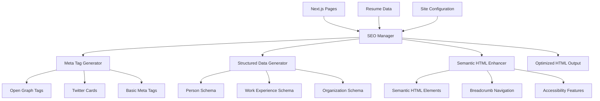

# Design Document: SEO and AI Optimization

## Overview

This design outlines the implementation of comprehensive SEO and AI scraping optimization for acevedomiguel.com, a Next.js personal portfolio website. The solution focuses on structured data implementation, meta tag optimization, semantic HTML enhancement, and AI-friendly content organization while maintaining performance and user experience.

The design leverages Next.js 16's built-in Metadata API and modern SEO best practices to create a system that enhances discoverability by search engines and AI systems without compromising site performance or maintainability.

## Architecture

### High-Level Architecture



### Component Architecture

The system follows a modular approach with clear separation of concerns:

1. **SEO Manager**: Central orchestrator that coordinates all SEO-related functionality
2. **Meta Tag Generator**: Handles all meta tag generation including Open Graph and Twitter Cards
3. **Structured Data Generator**: Creates JSON-LD structured data for various schema types
4. **Semantic HTML Enhancer**: Ensures proper HTML5 semantic structure
5. **Content Optimizer**: Optimizes content for AI readability and search engines

## Components and Interfaces

### SEO Manager Component

```typescript
interface SEOManagerProps {
  pageType: 'home' | 'resume' | 'contact' | 'generic';
  title?: string;
  description?: string;
  canonicalUrl?: string;
  structuredData?: StructuredDataConfig;
  openGraph?: OpenGraphConfig;
  additionalMeta?: MetaTag[];
}

interface SEOManager {
  generateMetaTags(config: SEOManagerProps): MetaTag[];
  generateStructuredData(config: StructuredDataConfig): string;
  generateBreadcrumbs(path: string): BreadcrumbItem[];
  validateSEOConfig(config: SEOManagerProps): ValidationResult;
}
```

### Meta Tag Generator

```typescript
interface MetaTagGenerator {
  generateBasicMeta(config: BasicMetaConfig): MetaTag[];
  generateOpenGraphMeta(config: OpenGraphConfig): MetaTag[];
  generateTwitterCardMeta(config: TwitterCardConfig): MetaTag[];
  generateCanonicalUrl(path: string): string;
}

interface MetaTag {
  name?: string;
  property?: string;
  content: string;
  key?: string;
}
```

### Structured Data Generator

```typescript
interface StructuredDataGenerator {
  generatePersonSchema(personData: PersonData): PersonSchema;
  generateWorkExperienceSchema(workData: WorkExperience[]): WorkExperienceSchema[];
  generateOrganizationSchema(orgData: OrganizationData): OrganizationSchema;
  generateWebsiteSchema(siteData: WebsiteData): WebsiteSchema;
  generateBreadcrumbSchema(breadcrumbs: BreadcrumbItem[]): BreadcrumbListSchema;
}

interface PersonSchema {
  "@context": "https://schema.org";
  "@type": "Person";
  name: string;
  jobTitle: string;
  description: string;
  url: string;
  image: string;
  email: string;
  telephone?: string;
  address: PostalAddress;
  sameAs: string[];
  worksFor: Organization[];
  knowsAbout: string[];
  alumniOf?: EducationalOrganization[];
}
```

### Semantic HTML Enhancer

```typescript
interface SemanticHTMLEnhancer {
  wrapWithSemanticElements(content: ReactNode, elementType: SemanticElement): ReactNode;
  generateHeadingHierarchy(content: ContentSection[]): ReactNode;
  addLandmarkRoles(component: ReactNode): ReactNode;
  enhanceAccessibility(component: ReactNode): ReactNode;
}

type SemanticElement = 'article' | 'section' | 'aside' | 'nav' | 'main' | 'header' | 'footer';
```

## Data Models

### Resume Data Enhancement

```typescript
interface EnhancedResumeData extends ResumeData {
  seo: {
    metaDescription: string;
    keywords: string[];
    structuredData: {
      person: PersonSchemaData;
      workExperience: WorkExperienceSchemaData[];
      skills: SkillSchemaData[];
    };
  };
}

interface PersonSchemaData {
  "@type": "Person";
  name: string;
  jobTitle: string;
  description: string;
  url: string;
  image: string;
  email: string;
  telephone?: string;
  address: {
    "@type": "PostalAddress";
    addressLocality: string;
    addressCountry: string;
    addressRegion?: string;
  };
  sameAs: string[];
  knowsAbout: string[];
}

interface WorkExperienceSchemaData {
  "@type": "WorkExperience";
  name: string;
  description: string;
  startDate: string;
  endDate?: string;
  employer: {
    "@type": "Organization";
    name: string;
    url?: string;
  };
  jobLocation: {
    "@type": "Place";
    address: {
      "@type": "PostalAddress";
      addressLocality: string;
      addressCountry: string;
    };
  };
  skills: string[];
}
```

### SEO Configuration Model

```typescript
interface SEOConfig {
  site: {
    name: string;
    url: string;
    description: string;
    author: PersonSchemaData;
    social: {
      twitter: string;
      linkedin?: string;
      github?: string;
    };
  };
  pages: {
    [key: string]: PageSEOConfig;
  };
  defaults: {
    titleTemplate: string;
    description: string;
    openGraph: OpenGraphDefaults;
    twitter: TwitterCardDefaults;
  };
}

interface PageSEOConfig {
  title: string;
  description: string;
  keywords: string[];
  structuredDataTypes: string[];
  canonicalUrl?: string;
  noindex?: boolean;
}
```

## Correctness Properties

*A property is a characteristic or behavior that should hold true across all valid executions of a system-essentially, a formal statement about what the system should do. Properties serve as the bridge between human-readable specifications and machine-verifiable correctness guarantees.*

Before defining the correctness properties, let me analyze the acceptance criteria from the requirements to determine which ones are testable as properties.

### Property 1: Structured Data Generation Completeness
*For any* page configuration and resume data, the SEO system should generate valid JSON-LD structured data that includes Person schema on all pages, WorkExperience schema for each job position, Organization schema for all employers, and ContactPoint schema when contact information is available
**Validates: Requirements 1.1, 1.2, 1.3, 1.4, 1.5**

### Property 2: Schema Validation Compliance  
*For any* generated structured data, it should validate successfully against Schema.org specifications
**Validates: Requirements 1.6**

### Property 3: Meta Tag Generation Completeness
*For any* page configuration, the Meta Manager should generate complete meta tags including unique descriptions within 150-160 characters, page titles under 60 characters, canonical URLs, Open Graph tags, Twitter Card tags, viewport tags, and language/locale tags
**Validates: Requirements 2.1, 2.2, 2.3, 2.4, 2.5, 2.6, 2.7**

### Property 4: Semantic HTML Structure Compliance
*For any* content structure, the SEO system should generate proper semantic HTML5 elements (article, section, aside, nav), maintain heading hierarchy (h1, h2, h3), include landmark roles, use appropriate list markup, provide descriptive alt text for images, and include skip navigation links
**Validates: Requirements 3.1, 3.2, 3.3, 3.4, 3.5, 3.6**

### Property 5: Navigation and Breadcrumb Structure
*For any* page path (except home), the system should generate hierarchical breadcrumb navigation with proper structured data markup
**Validates: Requirements 4.1, 4.2**

### Property 6: Sitemap and Linking Structure
*For any* site structure, the SEO system should generate XML sitemap with priority and change frequency metadata, HTML sitemap for navigation, and implement internal links with descriptive anchor text
**Validates: Requirements 4.3, 4.4, 4.5**

### Property 7: Technical SEO Configuration
*For any* site configuration, the SEO system should generate optimized robots.txt with crawler instructions, implement proper HTTP status codes, include hreflang tags when applicable, implement structured URL patterns, and include resource preloading tags
**Validates: Requirements 5.1, 5.3, 5.4, 5.6, 7.5**

### Property 8: Content Organization and Structure
*For any* resume data, the SEO system should organize content in logical sections with clear headings, implement consistent formatting for dates/locations/skills, provide context for abbreviations, structure work experience clearly, use consistent naming conventions, and include summary sections
**Validates: Requirements 6.1, 6.2, 6.3, 6.4, 6.5, 6.6**

### Property 9: Data Consistency Maintenance
*For any* content update, the SEO system should maintain consistency across all data sources, implement content freshness indicators, and ensure external links include appropriate rel attributes
**Validates: Requirements 8.2, 8.3, 8.4**

## Error Handling

### Structured Data Errors
- **Invalid Schema Data**: When resume data is missing required fields, the system should generate default values or omit optional schema properties rather than producing invalid JSON-LD
- **Schema Validation Failures**: The system should log validation errors and fall back to basic schema structures when complex schemas fail validation
- **Missing Contact Information**: When contact data is unavailable, the system should gracefully omit ContactPoint schema rather than generating empty or invalid markup

### Meta Tag Generation Errors
- **Missing Page Data**: When page-specific data is unavailable, the system should fall back to site-wide defaults for titles and descriptions
- **Character Limit Violations**: When generated content exceeds character limits, the system should truncate intelligently at word boundaries and add ellipsis
- **Invalid URLs**: When canonical URLs cannot be determined, the system should use the current page URL as fallback

### Content Structure Errors
- **Missing Heading Hierarchy**: When content lacks proper heading structure, the system should automatically generate appropriate headings based on content sections
- **Invalid HTML Structure**: When semantic HTML generation fails, the system should fall back to basic div structures with appropriate ARIA labels
- **Image Processing Errors**: When images cannot be processed for alt text generation, the system should use filename-based descriptions as fallback

### Performance Degradation
- **Large Resume Data**: When resume data is exceptionally large, the system should implement pagination or summarization to maintain performance
- **Schema Generation Timeouts**: When structured data generation takes too long, the system should cache results and serve cached versions for subsequent requests
- **Bundle Size Limits**: When SEO enhancements increase bundle size significantly, the system should implement lazy loading for non-critical SEO components

## Testing Strategy

### Dual Testing Approach

The testing strategy employs both unit testing and property-based testing to ensure comprehensive coverage:

**Unit Tests** focus on:
- Specific examples of schema generation with known resume data
- Edge cases like missing contact information or incomplete work experience
- Integration points between SEO components and Next.js pages
- Error conditions and fallback behaviors
- Specific meta tag generation scenarios

**Property-Based Tests** focus on:
- Universal properties that hold across all possible resume data configurations
- Schema validation across randomly generated professional profiles
- Meta tag generation consistency across various page types
- Semantic HTML structure maintenance regardless of content complexity
- Comprehensive input coverage through randomization

### Property-Based Testing Configuration

The implementation will use **fast-check** for TypeScript property-based testing with the following configuration:
- **Minimum 100 iterations** per property test to ensure thorough coverage
- Each property test references its corresponding design document property
- Tag format: **Feature: seo-ai-optimization, Property {number}: {property_text}**

### Test Coverage Requirements

**Schema Generation Testing**:
- Property tests validate schema structure across all possible resume data combinations
- Unit tests verify specific schema examples and error handling
- Integration tests ensure schema appears correctly in rendered HTML

**Meta Tag Testing**:
- Property tests ensure meta tag completeness across all page configurations
- Unit tests verify specific Open Graph and Twitter Card implementations
- Performance tests ensure meta tag generation doesn't impact page load times

**Semantic HTML Testing**:
- Property tests validate HTML structure across various content types
- Unit tests verify specific accessibility features and landmark roles
- Integration tests ensure proper heading hierarchy in rendered pages

**Content Organization Testing**:
- Property tests ensure consistent formatting across all resume data variations
- Unit tests verify specific content structure examples
- Integration tests validate complete page rendering with SEO enhancements

Each correctness property from the design document must be implemented by a single property-based test, ensuring direct traceability between design specifications and test validation.